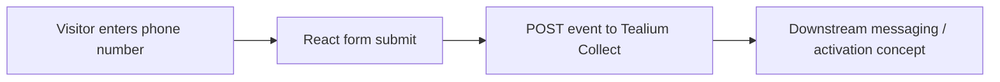

# The Daily

Historical Gatsby prototype for a small event-triggered messaging workflow.

The visible app was a light pandemic-era page that answered "what day is it?" and accepted a phone number. The technical artifact is the form flow: submit a phone number, send an event to Tealium Collect, and use that event as the handoff point for downstream messaging or activation.

## What This Demonstrates

- Gatsby/React prototype updated to a newer Gatsby 5 dependency surface.
- Client-side form state and submission handling.
- Tealium tag loading through `utag.js`.
- Event forwarding to Tealium Collect with a phone-number payload.
- A small proof of concept for event-triggered customer messaging.

## Data Flow



Key files:

- `src/pages/index.js` renders the main page and form.
- `src/components/form.js` handles the phone-number submission.
- `src/html.js` loads the historical Tealium tag and page data object.

## Running Locally

```bash
npm install
npm run develop
```

## Repository Status

This is a legacy/sanitized prototype, not a production messaging service. Do not treat the phone-number handling as production-ready privacy, consent, validation, or security design.

Its portfolio value is narrow: a small example of connecting a frontend interaction to a customer-data/event pipeline.
